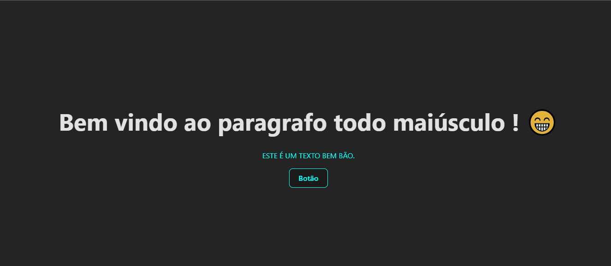

# DESAFIO REACT BASE
### Curso DEV Quest ''Desafio react base''

Para mais projetos como esse, acompanhe o git hub e o meu LinkedIn

## Como fazer funcionar

Utilize `npm install`
depois `npm run dev`

## Objetivo do desafio

`Desafio 1` 
Renderizar um parágrafo na tela colorido com letras maiúsculas. ✅

Utilizar props para passar o texto e a cor desejada dentro do componente. ✅

`Desafio 2` 
Crie um componente Button com um evento de clique que
apresente um alerta informando a prop label do botão quefoi clicado, com a seguinte mensagem: "A label desse botão é 'insira a label aqui via JS"'. ✅

# Resultado

